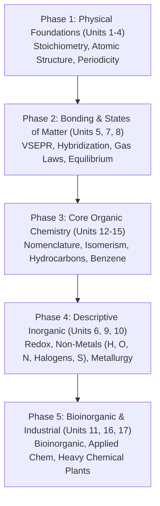

# EduBoost Nepal — Chemistry Grade 11 Content Gap Tracker

**Document Version:** 1.0.0  
**Target Curriculum:** National Examinations Board (NEB) / Curriculum Development Centre (CDC) Nepal  
**Source Material:** Official CDC Chemistry Grade 11 Textbook (*First Edition 2024*, 712 pages, 17 Units)  
**Evaluated Codebase:** EduBoost Nepal (`js/static-notes.js` — `window.staticNotes`)  
**Scope:** Complete sub-topic decomposition and readiness audit for Grade 11 Chemistry notes  
**Status:** Planning Artifact (Read-Only Audit — No note content or code modifications)

---

## 1. Executive Summary

### 1.1 Overview & Curriculum Architecture
The official CDC Grade 11 Chemistry textbook (*First Edition 2024*) spans **712 pages** across **17 major Units**. Structurally, Grade 11 Chemistry differs substantially from modular high school science curricula (such as Physics): instead of numerous granular, self-contained chapters, Chemistry is organized into broad macro-units ranging from **17 to 113 pages each**. 

Units such as *Unit 9: Chemistry of Non-Metals* (113 pages), *Unit 5: Chemical Bonding and Shapes of Molecules* (73 pages), and *Unit 10: Chemistry of Metals* (61 pages) encapsulate multiple foundational topics (e.g., individual elemental families, industrial synthesis, stereochemistry, and advanced quantum concepts). Treating each unit as a single monolithic content note would severely impair student learning and retention.

To provide rigorous educational utility, every unit in this tracker has been parsed into granular **teachable sub-topics** (totaling **173 distinct sub-topics** across all 17 units) mapped to actual textbook page references.

---

### 1.2 Evaluation Methodology & Status Criteria

Each identified sub-topic is cross-referenced against `window.staticNotes` in `js/static-notes.js`. Notes are classified into one of three statuses:

- **`Present`**: A dedicated, high-quality note exists in `window.staticNotes` specifically authored for NEB Class 11 Chemistry covering the core theoretical and numerical syllabus of that sub-topic.
- **`Partial`**: The sub-topic has partial coverage in `window.staticNotes` through a related entry (e.g., an existing Class 12 Chemistry note that touches on foundational concepts), but lacks dedicated Class 11 curriculum alignment, practice questions, or complete theoretical scope.
- **`Missing`**: No note or resource exists in `window.staticNotes` addressing this sub-topic for Grade 11.

#### Current Static Notes Inventory (Chemistry):
Currently, `window.staticNotes` in `js/static-notes.js` contains **0 Grade 11 Chemistry notes** and **5 Grade 12 Chemistry notes**:
1. `chem12-ionic` — *Ionic Equilibrium — Chapter 2* (Class 12)
2. `chem12-volumetric` — *Volumetric Analysis — NEB Class 12* (Class 12)
3. `chem12-kinetics` — *Chemical Kinetics — NEB Class 12* (Class 12)
4. `chem12-electrochemistry` — *Electrochemistry — NEB Class 12* (Class 12)
5. `chem12-thermodynamics` — *Thermodynamics — NEB Class 12* (Class 12)

---

### 1.3 Quantitative Coverage Metrics

| Metric | Count | Percentage |
| :--- | :--- | :--- |
| **Total Official CDC Units** | 17 Units | 100.0% |
| **Total Identified Sub-Topics** | 173 Sub-Topics | 100.0% |
| **Present (Grade 11 Dedicated)** | 5 Sub-Topics | **2.9%** |
| **Partial (Cross-Curricular Grade 12 Overlap)** | 3 Sub-Topics | **1.7%** |
| **Missing (Zero Coverage in Grade 11)** | 165 Sub-Topics | **95.4%** |
| **Effective Content Readiness** | — | **3.8%** (weighted: Present = 1.0, Partial = 0.5) |

> [!NOTE]
> **Phase 1 Production Underway**: Unit 1 (*Fundamentals of Chemistry*, 5 sub-topics) is now officially published in `js/static-notes.js` under ID `chem11-fundamentals-of-chemistry`. Grade 11 Chemistry coverage has advanced from 0.0% to 3.8%.

---

### 1.4 Unit-by-Unit Content Coverage Summary

| Unit | Title | Page Range | Sub-Topics | Present | Partial | Missing | Coverage % |
| :---: | :--- | :---: | :---: | :---: | :---: | :---: | :---: |
| **1** | Fundamentals of Chemistry | 1–30 | 5 | 5 | 0 | 0 | 100.0% |
| **2** | Stoichiometry | 31–71 | 8 | 0 | 1 | 7 | 6.3% |
| **3** | Atomic Structure | 72–108 | 13 | 0 | 0 | 13 | 0.0% |
| **4** | Classification of Elements | 109–138 | 9 | 0 | 0 | 9 | 0.0% |
| **5** | Chemical Bonding & Shapes of Molecules | 139–211 | 14 | 0 | 0 | 14 | 0.0% |
| **6** | Oxidation and Reduction | 212–251 | 6 | 0 | 2 | 4 | 16.7% |
| **7** | States of Matter | 252–324 | 16 | 0 | 0 | 16 | 0.0% |
| **8** | Chemical Equilibrium | 325–349 | 5 | 0 | 0 | 5 | 0.0% |
| **9** | Chemistry of Non-Metals | 350–462 | 25 | 0 | 0 | 25 | 0.0% |
| **10** | Chemistry of Metals | 463–523 | 12 | 0 | 0 | 12 | 0.0% |
| **11** | Bioinorganic Chemistry | 524–540 | 5 | 0 | 0 | 5 | 0.0% |
| **12** | Basic Concept of Organic Chemistry | 541–568 | 7 | 0 | 0 | 7 | 0.0% |
| **13** | Fundamental Principle of Organic Chemistry | 569–609 | 10 | 0 | 0 | 10 | 0.0% |
| **14** | Hydrocarbons | 610–642 | 12 | 0 | 0 | 12 | 0.0% |
| **15** | Aromatic Hydrocarbons | 643–663 | 8 | 0 | 0 | 8 | 0.0% |
| **16** | Fundamentals of Applied Chemistry | 664–684 | 9 | 0 | 0 | 9 | 0.0% |
| **17** | Modern Chemical Manufactures | 685–710 | 9 | 0 | 0 | 9 | 0.0% |
| **Total** | **All 17 Units** | **1–710** | **173** | **5** | **3** | **165** | **3.8%** |

---

## 2. Full Sub-Topic Breakdown & Gap Tracker Table

### Unit 1: Fundamentals of Chemistry (pp. 1–30)
*Covers introductory scope, classifications of matter, atomic/molecular masses, and formula composition.*

| Unit | Sub-topic | Page | Status | Matching Entry | Notes |
| :--- | :--- | :---: | :---: | :---: | :--- |
| Unit 1 | 1.1 General introduction to chemistry & historical development | 2 | Present | `chem11-fundamentals-of-chemistry` | Published in `static-notes.js`. Full history and scope. |
| Unit 1 | 1.1.1 Divisions of chemistry (Organic, Inorganic, Physical, Bio, Nuclear, Analytical, Environmental, Forensic) | 3 | Present | `chem11-fundamentals-of-chemistry` | Published in `static-notes.js`. All 8 major branches. |
| Unit 1 | 1.2 Importance and scope of chemistry in modern society & industry | 7 | Present | `chem11-fundamentals-of-chemistry` | Published in `static-notes.js`. Smartphone & industrial applications. |
| Unit 1 | 1.3 Basic concepts of chemistry (matter, elements, compounds, mixtures, atomic/molecular mass, formula mass) | 9 | Present | `chem11-fundamentals-of-chemistry` | Published in `static-notes.js`. SVG hierarchy, mass concepts, criss-cross formulas. |
| Unit 1 | 1.4 Percentage composition & empirical / molecular formula relations | 22 | Present | `chem11-fundamentals-of-chemistry` | Published in `static-notes.js`. Fertilizer % N analysis and empirical/molecular calculations. |

---

### Unit 2: Stoichiometry (pp. 31–71)
*Covers foundational chemical laws, Avogadro's hypothesis, mole concept, and quantitative reaction yields.*

| Unit | Sub-topic | Page | Status | Matching Entry | Notes |
| :--- | :--- | :---: | :---: | :---: | :--- |
| Unit 2 | 2.1 Dalton's atomic theory and its modern postulates & limitations | 31 | Missing | None | Core postulates, validation, and modern atomic modifications. |
| Unit 2 | 2.2 Laws of stoichiometry / Chemical combination (Mass Conservation, Definite, Multiple, Reciprocal, Gay-Lussac) | 31 | Missing | None | Crucial 5 historical laws with experimental verifications. |
| Unit 2 | 2.3 Avogadro's law and its deductions (atomicity, molar volume, M = 2 x V.D.) | 40 | Missing | None | Derivation of molar volume (22.4 L at STP) and vapor density link. |
| Unit 2 | 2.4 Mole concept and relations (mass, volume, and Avogadro's number $N_A$) | 44 | Missing | None | Core mole triangle relations: mass $\leftrightarrow$ moles $\leftrightarrow$ particles. |
| Unit 2 | 2.5 Quantitative calculations based on chemical equations (Stoichiometry) | 51 | Partial | `chem12-volumetric` | `chem12-volumetric` covers titration stoichiometry; missing Grade 11 mass-mass/mass-volume gravimetric numericals. |
| Unit 2 | 2.6 Limiting reactant and excess reactant calculations | 56 | Missing | None | Determination of limiting reagent, excess remaining, product mass. |
| Unit 2 | 2.7 Theoretical yield, experimental yield, and percentage yield | 59 | Missing | None | Industrial yield calculations and practical efficiency metrics. |
| Unit 2 | 2.8 Empirical and molecular formula determination from elemental data | 60 | Missing | None | Standard NEB examination long-numerical problem type. |

---

### Unit 3: Atomic Structure (pp. 72–108)
*Covers atomic models, wave-particle duality, quantum mechanics, and electronic configuration.*

| Unit | Sub-topic | Page | Status | Matching Entry | Notes |
| :--- | :--- | :---: | :---: | :---: | :--- |
| Unit 3 | 3.1 Rutherford's alpha-scattering experiment and nuclear atomic model | 73 | Missing | None | Discovery of nucleus, planetary model, experimental apparatus. |
| Unit 3 | 3.2 Limitations of Rutherford's atomic model (classical Maxwell electrodynamics) | 74 | Missing | None | Orbital collapse paradox and inability to explain discrete spectra. |
| Unit 3 | 3.3 Postulates of Bohr's atomic model and quantized energy levels | 75 | Missing | None | Angular momentum quantization ($mvr = nh/2\pi$) and energy states. |
| Unit 3 | 3.4 Atomic spectrum of hydrogen (Lyman, Balmer, Paschen, Brackett, Pfund series) | 76 | Missing | None | Rydberg equation, spectral lines, photon energy calculations. |
| Unit 3 | 3.5 Defects and limitations of Bohr's theory (Zeeman, Stark, fine spectra) | 79 | Missing | None | Inability to explain multi-electron atoms, splitting in fields. |
| Unit 3 | 3.6 Elementary idea of quantum mechanical model (de Broglie dual nature) | 80 | Missing | None | Matter waves: $\lambda = h/mv$; wave-particle duality. |
| Unit 3 | 3.7 Heisenberg's Uncertainty Principle ($\Delta x \cdot \Delta p \ge h/4\pi$) | 82 | Missing | None | Physical significance, macroscopic vs microscopic implications. |
| Unit 3 | 3.8 Concept of probability, probability density, and atomic orbitals | 83 | Missing | None | Transition from deterministic orbits to 3D electron cloud orbitals. |
| Unit 3 | 3.9 Four Quantum Numbers ($n$, $l$, $m_l$, $m_s$) and their physical significance | 85 | Missing | None | Principal, azimuthal, magnetic, and spin quantum numbers. |
| Unit 3 | 3.10 Orbitals and boundary surface diagrams / shapes of $s$ and $p$ orbitals | 90 | Missing | None | Spherical $s$, dumbbell $p_x, p_y, p_z$, and cloverleaf $d$ orbital geometries. |
| Unit 3 | 3.11 Pauli's Exclusion Principle and orbital capacity | 92 | Missing | None | No two electrons with identical 4 quantum numbers; max 2 per orbital. |
| Unit 3 | 3.12 Aufbau Principle and $(n + l)$ energy rule | 93 | Missing | None | Progressive filling order of sublevels by increasing energy. |
| Unit 3 | 3.13 Hund's Rule of Maximum Multiplicity & electronic configurations | 95 | Missing | None | Orbital degeneracy, spin alignment, anomalous Cr ($3d^5 4s^1$) & Cu ($3d^{10} 4s^1$). |

---

### Unit 4: Classification of Elements and Periodicity (pp. 109–138)
*Covers modern periodic law, block classification, screening effect, and periodic periodic trends.*

| Unit | Sub-topic | Page | Status | Matching Entry | Notes |
| :--- | :--- | :---: | :---: | :---: | :--- |
| Unit 4 | 4.1 Modern periodic law and structure of the modern periodic table | 110 | Missing | None | Moseley's atomic number law, periods (1-7), groups (1-18). |
| Unit 4 | 4.1.1 Classification of elements into blocks ($s$-, $p$-, $d$-, $f$-blocks) | 111 | Missing | None | Electronic configuration basis, characteristics of each block. |
| Unit 4 | 4.1.2 Classification of elements into metals, non-metals, and metalloids | 114 | Missing | None | Physical/chemical properties, diagonal dividing line, semiconductors. |
| Unit 4 | 4.2 Nuclear charge, screening / shielding effect, and effective nuclear charge ($Z_{\text{eff}}$) | 116 | Missing | None | Slater's concept, inner shell shielding, trend across periods/groups. |
| Unit 4 | 4.3.1 Periodic trend: Atomic radius (covalent, metallic, van der Waals radii) | 119 | Missing | None | Variation down group and across period; noble gas radius anomaly. |
| Unit 4 | 4.3.2 Periodic trend: Ionic radius (cationic vs anionic, isoelectronic series) | 121 | Missing | None | Radius reduction in cations, expansion in anions, $Z/e$ ratio. |
| Unit 4 | 4.3.3 Periodic trend: Ionization energy / enthalpy (1st, 2nd, successive IE) | 123 | Missing | None | Factors affecting IE: nuclear charge, radius, shielding, subshell stability. |
| Unit 4 | 4.3.4 Periodic trend: Electronegativity (Pauling scale & periodic variation) | 125 | Missing | None | Attraction of shared electron pair, trend across periods and down groups. |
| Unit 4 | 4.3.5 Periodic trend: Electron Affinity / Electron gain enthalpy | 127 | Missing | None | Energy change on electron addition, halogens vs noble gases, Cl > F anomaly. |

---

### Unit 5: Chemical Bonding and Shapes of Molecules (pp. 139–211)
*Covers ionic/covalent bonding, Lewis structures, resonance, VSEPR, VBT, hybridization, and intermolecular forces.*

| Unit | Sub-topic | Page | Status | Matching Entry | Notes |
| :--- | :--- | :---: | :---: | :---: | :--- |
| Unit 5 | 5.1 Valence shell, valence electrons, and octet rule (Lewis-Kossel theory) | 139 | Missing | None | Electronic theory of valency, noble gas stability, octet exceptions. |
| Unit 5 | 5.2 Ionic (electrovalent) bond, lattice enthalpy, and ionic characteristics | 142 | Missing | None | Conditions for ionic formation, lattice energy, hydration energy. |
| Unit 5 | 5.3 Covalent bond and coordinate covalent (dative) bond | 146 | Missing | None | Single/double/triple bonds, dative bond in $\text{NH}_4^+$, $\text{H}_3\text{O}^+$, $\text{BF}_3\cdot\text{NH}_3$. |
| Unit 5 | 5.4 General characteristics and physical properties of covalent compounds | 155 | Missing | None | Melting/boiling points, solubility in polar/nonpolar solvents, conductivity. |
| Unit 5 | 5.5 Lewis dot structures and formal charges of molecules and polyatomic ions | 155 | Missing | None | Stepwise drawing rules for $\text{CO}_3^{2-}, \text{NO}_2^-, \text{SO}_4^{2-}, \text{O}_3$. |
| Unit 5 | 5.6 Resonance and resonance hybrid | 158 | Missing | None | Delocalization of electrons, canonical structures, stability of hybrids. |
| Unit 5 | 5.7 VSEPR Theory (Valence Shell Electron Pair Repulsion) & molecular geometries | 162 | Missing | None | Electron pair repulsions ($lp-lp > lp-bp > bp-bp$), linear to octahedral shapes. |
| Unit 5 | 5.8 Valence Bond Theory (VBT) and orbital overlapping ($\sigma$ and $\pi$ bonds) | 170 | Missing | None | Axial (head-on) vs lateral (sideways) overlap, bond strength comparison. |
| Unit 5 | 5.9 Hybridization ($sp, sp^2, sp^3, sp^3d, sp^3d^2$) and geometry of molecules | 175 | Missing | None | Mixing of orbitals; shapes of $\text{BeCl}_2, \text{BF}_3, \text{CH}_4, \text{PCl}_5, \text{SF}_6, \text{H}_2\text{O}, \text{NH}_3$. |
| Unit 5 | 5.10.1 Molecular parameters: Dipole moment, bond polarity, % ionic character | 184 | Missing | None | $\mu = q \times d$, polar vs nonpolar molecules, vector addition of dipoles. |
| Unit 5 | 5.10.2 Molecular parameters: Bond length, bond order, and bond strength | 186 | Missing | None | Bond order correlations with bond length and bond dissociation enthalpy. |
| Unit 5 | 5.10.3 Molecular parameters: Bond angle and factors affecting bond angle | 188 | Missing | None | Hybridization effect, lone pair repulsion, electronegativity of central atom. |
| Unit 5 | 5.11 Intermolecular forces (van der Waals forces, London dispersion, dipole-dipole) | 190 | Missing | None | Origin of dispersion forces, dipole-induced dipole, boiling point trends. |
| Unit 5 | 5.12 Hydrogen bonding (inter & intramolecular) and anomalous properties of water | 192 | Missing | None | Requirements for H-bonding, high BP of $\text{H}_2\text{O}$ vs $\text{H}_2\text{S}$, density anomaly of ice. |
| Unit 5 | 5.13 Metallic bonding (Electron Sea Model) and properties of metallic solids | 195 | Missing | None | Delocalized electron pool, electrical/thermal conductivity, malleability, ductility. |

---

### Unit 6: Oxidation and Reduction (pp. 212–251)
*Covers classical/electronic redox concepts, oxidation numbers, redox balancing, and electrolysis.*

| Unit | Sub-topic | Page | Status | Matching Entry | Notes |
| :--- | :--- | :---: | :---: | :---: | :--- |
| Unit 6 | 6.1 Classical and electronic concepts of oxidation and reduction | 212 | Missing | None | Gain/loss of oxygen/hydrogen, electron transfer definitions (OIL RIG). |
| Unit 6 | 6.2 Oxidation number and rules for assigning oxidation states | 219 | Missing | None | Formal rules, fractional oxidation numbers, peroxides and superoxides. |
| Unit 6 | 6.3.1 Balancing redox reactions: Oxidation Number Method | 224 | Partial | `chem12-electrochemistry` | `chem12-electrochemistry` covers redox in cell potentials; missing dedicated Grade 11 step-by-step balancing tutorial. |
| Unit 6 | 6.3.2 Balancing redox reactions: Ion-Electron (Half-Reaction) Method | 226 | Missing | None | Acidic and alkaline media half-reaction balancing rules. |
| Unit 6 | 6.4.1 Qualitative aspects of electrolysis (preferential discharge theory) | 232 | Missing | None | Electrolytes, cathode/anode reactions, discharge potential of ions. |
| Unit 6 | 6.4.2 Quantitative aspects of electrolysis (Faraday's 1st & 2nd Laws) | 236 | Partial | `chem12-electrochemistry` | `chem12-electrochemistry` covers Faraday's laws at Class 12 depth; missing Grade 11 fundamental numerical drill. |

---

### Unit 7: States of Matter (pp. 252–324)
*Covers kinetic theory of gases, ideal/real gas laws, liquid properties, liquid crystals, and solid-state lattices.*

| Unit | Sub-topic | Page | Status | Matching Entry | Notes |
| :--- | :--- | :---: | :---: | :---: | :--- |
| Unit 7 | 7.1.1 Kinetic molecular theory of gases and fundamental postulates | 255 | Missing | None | Kinetic postulates, molecular collisions, temperature-kinetic energy link. |
| Unit 7 | 7.1.2 Gas laws: Boyle's Law ($P \propto 1/V$) and Charles's Law ($V \propto T$) | 257 | Missing | None | Graphical representations ($P-V, V-T$), absolute zero scale. |
| Unit 7 | 7.1.2.1 Gay-Lussac's Law ($P \propto T$) and combined gas equation | 260 | Missing | None | $P_1V_1/T_1 = P_2V_2/T_2$ multi-step numerical calculations. |
| Unit 7 | 7.1.2.2 Avogadro's Gas Law and molar volume deduction | 265 | Missing | None | Equal volumes under identical $T, P$ contain equal molecules. |
| Unit 7 | 7.1.2.3 Dalton's Law of Partial Pressures and aqueous tension correction | 267 | Missing | None | $P_{\text{total}} = \sum P_i$; collection of gas over water: $P_{\text{dry}} = P_{\text{moist}} - \text{aq. tension}$. |
| Unit 7 | 7.1.2.4 Graham's Law of Diffusion and Effusion ($r \propto 1/\sqrt{d}$) | 271 | Missing | None | Comparison of diffusion rates: $r_1/r_2 = \sqrt{M_2/M_1}$; separation of isotopes. |
| Unit 7 | 7.1.3 Ideal gas equation ($PV = nRT$) and universal gas constant ($R$) | 275 | Missing | None | Units of $R$ ($\text{J}\cdot\text{K}^{-1}\cdot\text{mol}^{-1}, \text{L}\cdot\text{atm}\cdot\text{K}^{-1}\cdot\text{mol}^{-1}, \text{cal}$). |
| Unit 7 | 7.1.4 Deviations of real gases from ideality (compressibility factor $Z$) | 278 | Missing | None | High pressure & low temperature causes; volume and pressure corrections. |
| Unit 7 | 7.1.5 van der Waals Equation of state for real gases | 280 | Missing | None | $(P + an^2/V^2)(V - nb) = nRT$; physical units and meaning of constants $a$ and $b$. |
| Unit 7 | 7.2.1 Physical properties of liquids: Evaporation, Vapor Pressure, and Boiling Point | 287 | Missing | None | Dynamic equilibrium, volatile liquids, Clausius-Clapeyron qualitative overview. |
| Unit 7 | 7.2.2 Surface tension of liquids (capillary action, meniscus, units) | 292 | Missing | None | Intermolecular cohesive forces, surface energy, effect of temperature. |
| Unit 7 | 7.2.3 Viscosity of liquids (coefficient of viscosity $\eta$, poise) | 296 | Missing | None | Laminar flow, velocity gradient, temperature dependence. |
| Unit 7 | 7.2.4 Liquid crystals (mesomorphic state, nematic, smectic, and LCD displays) | 300 | Missing | None | Intermediate state between solid and liquid; technological applications. |
| Unit 7 | 7.3.1 Classification of solids: Crystalline vs Amorphous solids | 309 | Missing | None | Long-range vs short-range order, sharp vs gradual melting point, anisotropy. |
| Unit 7 | 7.3.2 Types of crystalline solids (molecular, ionic, metallic, covalent network) | 310 | Missing | None | Constituent particles, binding forces, electrical conductivity, hardness. |
| Unit 7 | 7.3.3 Efflorescent, hygroscopic, and deliquescent substances | 311 | Missing | None | Vapor pressure vs atmospheric moisture, examples ($\text{CuSO}_4\cdot 5\text{H}_2\text{O}, \text{NaOH}, \text{CaCl}_2$). |
| Unit 7 | 7.3.4 Crystallization, crystal growth, and water of crystallization | 313 | Missing | None | Supersaturated solutions, seeding, calculation of water of crystallization. |
| Unit 7 | 7.3.5 Introduction to crystal lattice, unit cell, and cubic crystal systems (SC, BCC, FCC) | 317 | Missing | None | Bravais lattices overview, number of atoms per unit cell in cubic systems. |

---

### Unit 8: Chemical Equilibrium (pp. 325–349)
*Covers reversible dynamics, Law of Mass Action, equilibrium constants $K_c$ and $K_p$, and Le Chatelier's Principle.*

| Unit | Sub-topic | Page | Status | Matching Entry | Notes |
| :--- | :--- | :---: | :---: | :---: | :--- |
| Unit 8 | 8.1 Reversible and irreversible chemical reactions | 325 | Missing | None | Static vs dynamic equilibrium, conditions for reversibility in closed systems. |
| Unit 8 | 8.2 Dynamic chemical equilibrium and its fundamental characteristics | 327 | Missing | None | Forward rate = backward rate, constancy of macroscopic properties, catalyst role. |
| Unit 8 | 8.3 Equilibrium in physical processes (phase transformations & dissolution) | 329 | Missing | None | Solid-liquid, liquid-vapor, solid-vapor, and gas-solution (Henry's Law). |
| Unit 8 | 8.4 Law of Mass Action, equilibrium constants ($K_c, K_p$), and relation ($K_p = K_c(RT)^{\Delta n}$) | 333 | Missing | None | Guldberg-Waage law, expressions for homogenous reactions, $\Delta n$ cases. |
| Unit 8 | 8.5 Le Chatelier's Principle and effects of concentration, pressure, temperature, catalyst | 337 | Missing | None | Industrial optimization of Haber's process ($\text{NH}_3$) and Contact process ($\text{SO}_3$). |

---

### Unit 9: Chemistry of Non-Metals (pp. 350–462)
*Covers detailed descriptive and synthetic chemistry of Hydrogen, Oxygen, Ozone, Nitrogen, Halogens, Carbon, Phosphorus, and Sulphur.*

| Unit | Sub-topic | Page | Status | Matching Entry | Notes |
| :--- | :--- | :---: | :---: | :---: | :--- |
| Unit 9 | 9.1.1 Position of Hydrogen in periodic table & chemistry of nascent and atomic hydrogen | 350 | Missing | None | Dual behavior (Group 1 vs Group 17), high reducing activity of nascent H. |
| Unit 9 | 9.1.2 Isotopes of Hydrogen (Protium, Deuterium, Tritium) | 353 | Missing | None | Nuclear compositions, abundance, radioactive decay of tritium. |
| Unit 9 | 9.1.3 Hydrogen as an alternative clean fuel (Hydrogen Economy) | 356 | Missing | None | High energy per unit mass, zero carbon emissions, storage challenges. |
| Unit 9 | 9.1.4 Heavy Water ($\text{D}_2\text{O}$): Preparation, properties, and nuclear applications | 357 | Missing | None | Electrolytic concentration of water, moderator in nuclear reactors. |
| Unit 9 | 9.2.1 Allotropes of Oxygen (Dioxygen $\text{O}_2$ and Ozone $\text{O}_3$) | 362 | Missing | None | Molecular geometry, allotropic comparison. |
| Unit 9 | 9.2.2 Oxygen ($\text{O}_2$): Laboratory preparation, properties, and industrial separation | 363 | Missing | None | Catalytic decomposition of $\text{KClO}_3$ with $\text{MnO}_2$, liquefaction of air. |
| Unit 9 | 9.2.3 Hydrogen Peroxide ($\text{H}_2\text{O}_2$): Preparation, properties, and dual redox nature | 367 | Missing | None | Auto-oxidation of 2-ethylanthraquinol, storage with stabilizer, bleaching. |
| Unit 9 | 9.2.4 Medical and industrial applications of Oxygen | 368 | Missing | None | Oxy-acetylene welding, medical ventilators, blast furnace steel enrichment. |
| Unit 9 | 9.3.1 Ozone ($\text{O}_3$): Occurrence and laboratory preparation (Siemens & Brodie ozonizers) | 373 | Missing | None | Silent electric discharge principle, conversion equilibrium. |
| Unit 9 | 9.3.2 Physical and chemical properties of Ozone (Oxidizing actions) | 373 | Missing | None | Oxidation of $\text{PbS} \to \text{PbSO}_4, \text{KI} \to \text{I}_2, \text{FeSO}_4 \to \text{Fe}_2(\text{SO}_4)_3$. |
| Unit 9 | 9.3.3 Tests for Ozone (Tailing of Mercury, Starch-Iodide paper) | 374 | Missing | None | Loss of meniscus in Hg ($\text{Hg}_2\text{O}$ formation), blue color with starch-iodide. |
| Unit 9 | 9.3.4 Ozone layer depletion: Mechanism (CFCs, $\text{NO}_x$) and environmental impact | 375 | Missing | None | Free radical chain mechanism ($\text{Cl}^\bullet + \text{O}_3 \to \text{ClO}^\bullet + \text{O}_2$), UV-B hazards. |
| Unit 9 | 9.3.5 Industrial and municipal uses of Ozone | 377 | Missing | None | Water purification / ozonation, food sterilization, bleaching agent. |
| Unit 9 | 9.4.1 Nitrogen ($\text{N}_2$): Electronic structure and reasons for chemical inertness | 381 | Missing | None | High triple bond dissociation enthalpy ($945\text{ kJ/mol}$). |
| Unit 9 | 9.4.2 Ammonia ($\text{NH}_3$): Laboratory preparation and chemical properties | 383 | Missing | None | Heating $\text{NH}_4\text{Cl} + \text{Ca(OH)}_2$, drying over quicklime, basicity, complexation. |
| Unit 9 | 9.4.3 Applications and hazards / toxicity of Ammonia | 386 | Missing | None | Refrigeration fluid, raw material for fertilizers, respiratory irritation. |
| Unit 9 | 9.4.4 Oxides and oxyacids of Nitrogen ($\text{HNO}_2, \text{HNO}_3$ structures) | 387 | Missing | None | Oxidation states (+1 to +5), Lewis dot structures and resonance. |
| Unit 9 | 9.4.5 Nitric Acid ($\text{HNO}_3$): Laboratory preparation and physical properties | 389 | Missing | None | Reaction of $\text{KNO}_3/\text{NaNO}_3 + \text{conc. } \text{H}_2\text{SO}_4$ in glass retort. |
| Unit 9 | 9.4.6 Chemical properties of Nitric Acid: Action on metals ($\text{Cu}, \text{Zn}, \text{Fe}$) and non-metals | 390 | Missing | None | Dilute vs concentrated $\text{HNO}_3$ redox mechanisms, passivity of Fe and Al. |
| Unit 9 | 9.4.7 Brown Ring Test for Nitrate Ion ($\text{NO}_3^-$) | 394 | Missing | None | Formation of nitroso ferrous sulphate complex $[\text{Fe(H}_2\text{O)}_5(\text{NO})]\text{SO}_4$. |
| Unit 9 | 9.5.1 Halogens: General characteristics, electronic configuration, and physical trends | 401 | Missing | None | Group 17 trends, color, volatility, bond dissociation energy anomaly ($\text{Cl}_2 > \text{Br}_2 > \text{F}_2$). |
| Unit 9 | 9.5.2 Comparative preparation and oxidizing power of halogens ($\text{F}_2, \text{Cl}_2, \text{Br}_2, \text{I}_2$) | 403 | Missing | None | Displacement reactions: $\text{F}_2 > \text{Cl}_2 > \text{Br}_2 > \text{I}_2$; laboratory halogen preparations. |
| Unit 9 | 9.5.3 Hydrogen Halides ($\text{HF}, \text{HCl}, \text{HBr}, \text{HI}$): Preparation, thermal stability, acid strength | 409 | Missing | None | Acidic strength order: $\text{HI} > \text{HBr} > \text{HCl} > \text{HF}$; reducing power trends. |
| Unit 9 | 9.5.4 Analytical tests for Halide Ions ($\text{Cl}^-, \text{Br}^-, \text{I}^-$) | 413 | Missing | None | $\text{AgNO}_3$ precipitation tests (solubility in $\text{NH}_4\text{OH}$), organic layer test with $\text{CCl}_4/\text{CHCl}_3$. |
| Unit 9 | 9.6.1 Carbon: Allotropes (Diamond, Graphite, Fullerenes) | 420 | Missing | None | Hybridization ($sp^3$ vs $sp^2$), electrical conductivity, thermal properties, buckyballs. |
| Unit 9 | 9.6.2 Carbon Monoxide ($\text{CO}$): Preparation, reducing action, and biological toxicity | 429 | Missing | None | Dehydration of oxalic/formic acid, carboxyhemoglobin formation, asphyxiation. |
| Unit 9 | 9.7.1 Phosphorus: Allotropes (White, Red, and Black Phosphorus) | 437 | Missing | None | Structural stability, chemiluminescence of white P, ignition temperatures. |
| Unit 9 | 9.7.2 Phosphine Gas ($\text{PH}_3$): Laboratory preparation, properties, and Holme's signals | 438 | Missing | None | $\text{P}_4 + 3\text{NaOH} + 3\text{H}_2\text{O} \to \text{PH}_3 + 3\text{NaH}_2\text{PO}_2$; spontaneous flammability ($\text{P}_2\text{H}_4$ impurity). |
| Unit 9 | 9.8.1 Sulphur: Allotropes (Rhombic, Monoclinic, Plastic Sulphur) | 442 | Missing | None | Transition temperature ($95.6^\circ\text{C}$), puckered $S_8$ crown ring structure. |
| Unit 9 | 9.8.2 Hydrogen Sulphide ($\text{H}_2\text{S}$): Preparation (Kipp's apparatus) & analytical role | 443 | Missing | None | $\text{FeS} + \text{H}_2\text{SO}_4$, group reagent for Group II and IIIB basic radicals in salt analysis. |
| Unit 9 | 9.8.3 Sulphur Dioxide ($\text{SO}_2$): Laboratory preparation and temporary bleaching action | 449 | Missing | None | Reduction bleaching vs chlorine oxidation bleaching, reducing properties. |
| Unit 9 | 9.8.4 Sulphuric Acid ($\text{H}_2\text{SO}_4$): Chemical properties (dehydrating, oxidizing agent) | 453 | Missing | None | Charring of sugar, action on metals, precipitation test with $\text{BaCl}_2$. |
| Unit 9 | 9.8.5 Sodium Thiosulphate ($\text{Na}_2\text{S}_2\text{O}_3\cdot 5\text{H}_2\text{O}$, Hypo): Preparation and photographic role | 458 | Missing | None | Fixing unexposed $\text{AgBr}$ via complex formation, iodometric titration reaction. |

---

### Unit 10: Chemistry of Metals (pp. 463–523)
*Covers general metallurgical principles, extraction of sodium, and properties/compounds of alkali and alkaline earth metals.*

| Unit | Sub-topic | Page | Status | Matching Entry | Notes |
| :--- | :--- | :---: | :---: | :---: | :--- |
| Unit 10 | 10.1.1 Metallurgy: Definition and classification (Pyro, Hydro, Electrometallurgy) | 463 | Missing | None | Primary thermodynamic and electrochemical extraction pathways. |
| Unit 10 | 10.1.2 Minerals and Ores: Classification and important ores of $\text{Fe}, \text{Cu}, \text{Al}, \text{Zn}, \text{Ag}$ | 465 | Missing | None | Distinction between minerals and ores, chemical formulas of major ores. |
| Unit 10 | 10.1.3 Metallurgical terms: Gangue, Flux (acidic/basic), Slag, Alloys, and Amalgams | 469 | Missing | None | Slag formation reactions ($\text{CaO} + \text{SiO}_2 \to \text{CaSiO}_3$), amalgam properties. |
| Unit 10 | 10.1.4 General extraction steps: Crushing, concentration (gravity, magnetic, froth floatation, leaching) | 472 | Missing | None | Froth floatation collectors/frothers, Bayer's leaching of bauxite. |
| Unit 10 | 10.1.5 Pyrometallurgical steps: Calcination, Roasting, and Smelting / Reduction | 476 | Missing | None | Thermal decomposition without air (calcination) vs with air (roasting), carbon/aluminothermic reduction. |
| Unit 10 | 10.1.6 Refining / Purification of crude metals (Liquation, Distillation, Electrolytic refining, Zone refining) | 480 | Missing | None | Purification of copper, zinc, lead, and semiconductor ultra-purification. |
| Unit 10 | 10.2.1 Alkali Metals (Group 1): Electronic configuration and periodic trends | 488 | Missing | None | Low ionization energy, flame test colors, strong reducing electropositive character. |
| Unit 10 | 10.2.2 Extraction of Metallic Sodium by Down's Process | 493 | Missing | None | Electrolysis of fused $\text{NaCl} + \text{CaCl}_2$ (flux), cell design, anode/cathode reactions. |
| Unit 10 | 10.2.3 Sodium Hydroxide ($\text{NaOH}$, Caustic Soda): Properties and chemical reactions | 499 | Missing | None | Action on amphoteric metals ($\text{Zn}, \text{Al}$), non-metals ($\text{P}_4, \text{S}_8, \text{Cl}_2$). |
| Unit 10 | 10.2.4 Sodium Carbonate ($\text{Na}_2\text{CO}_3\cdot 10\text{H}_2\text{O}$, Washing Soda): Properties and efflorescence | 502 | Missing | None | Loss of water of crystallization to form monohydrate, soda ash, basic reactions. |
| Unit 10 | 10.3.1 Alkaline Earth Metals (Group 2): Periodic trends and comparison with Group 1 | 505 | Missing | None | Higher ionization energy, flame coloration, diagonal relationship ($\text{Li}-\text{Mg}, \text{Be}-\text{Al}$). |
| Unit 10 | 10.3.2 Important compounds of Group 2: Quicklime ($\text{CaO}$), Slaked lime ($\text{Ca(OH)}_2$), Plaster of Paris, Bleaching powder | 510 | Missing | None | Setting of Plaster of Paris ($\text{CaSO}_4\cdot\frac{1}{2}\text{H}_2\text{O}$), manufacture and active chlorine in bleaching powder. |
| Unit 10 | 10.3.3 Solubility trends of Group 2 Hydroxides, Carbonates, and Sulphates | 512 | Missing | None | Lattice energy vs hydration enthalpy balance down the group. |
| Unit 10 | 10.3.4 Thermal stability of Carbonates and Nitrates of Alkaline Earth Metals | 515 | Missing | None | Polarizing power of cation (Fajan's rule), decomposition to metal oxides and $\text{NO}_2$. |

---

### Unit 11: Bioinorganic Chemistry (pp. 524–540)
*Covers micronutrients/macronutrients, biological functions of metal ions, ion pumps, and heavy metal toxicity.*

| Unit | Sub-topic | Page | Status | Matching Entry | Notes |
| :--- | :--- | :---: | :---: | :---: | :--- |
| Unit 11 | 11.1 Introduction to Bioinorganic Chemistry | 525 | Missing | None | Scope of inorganic elements in biological and cellular systems. |
| Unit 11 | 11.2 Classification of bio-elements: Micronutrients (trace) and Macronutrients (bulk) | 525 | Missing | None | Essential elements ($\text{C, H, O, N, P, K, Ca, Mg, Fe, Zn, Cu, Mo, I}$). |
| Unit 11 | 11.3 Biological significance of essential metal ions ($\text{Na}^+, \text{K}^+, \text{Ca}^{2+}, \text{Mg}^{2+}, \text{Fe}^{2+}/\text{Fe}^{3+}, \text{Zn}^{2+}, \text{Cu}^{2+}$) | 528 | Missing | None | Hemoglobin ($\text{Fe}$), Chlorophyll ($\text{Mg}$), bones/teeth & muscle contraction ($\text{Ca}$), enzyme active sites. |
| Unit 11 | 11.4 Biological Ion Transport: Sodium-Potassium Pump ($\text{Na}^+/\text{K}^+$-ATPase) and Glucose Transport | 531 | Missing | None | Active transport across cell membranes, maintaining resting membrane potential. |
| Unit 11 | 11.5 Metal Toxicity: Physiological hazards of heavy metals ($\text{Pb}, \text{Hg}, \text{Cd}, \text{As}$) | 534 | Missing | None | Binding to sulfhydryl groups, Minamata disease ($\text{Hg}$), Itai-itai disease ($\text{Cd}$), lead poisoning. |

---

### Unit 12: Basic Concept of Organic Chemistry (pp. 541–568)
*Covers nature of carbon, classification of organic compounds, homologous series, formulas, and petroleum chemistry.*

| Unit | Sub-topic | Page | Status | Matching Entry | Notes |
| :--- | :--- | :---: | :---: | :---: | :--- |
| Unit 12 | 12.1 Introduction to Organic Chemistry, Vital Force Theory, and Wohler's Synthesis | 541 | Missing | None | Demise of Berzelius' vital force theory by synthesis of urea from $\text{NH}_4\text{CNO}$. |
| Unit 12 | 12.2 Reasons for separate study of organic compounds | 543 | Missing | None | Immense number of carbon compounds, covalent nature, combustibility, slower reaction rates. |
| Unit 12 | 12.3 Tetra-covalency and catenation property of carbon ($sp^3, sp^2, sp$ hybridization) | 544 | Missing | None | Self-linking capacity, strong $\text{C}-\text{C}$ bond energy, formation of chains and rings. |
| Unit 12 | 12.4 Classification of organic compounds (Acyclic/Aliphatic vs Cyclic: Homocyclic, Heterocyclic, Aromatic) | 546 | Missing | None | Systematic structural classification hierarchy with representative examples. |
| Unit 12 | 12.5 Functional groups, alkyl groups, and homologous series | 551 | Missing | None | Characteristic chemical reactivity, general formula, physical gradation in homologous series. |
| Unit 12 | 12.6 Representation of organic formulas (Complete, Condensed, Bond-line, Wedge-dash) | 554 | Missing | None | Translating between condensed structures and zig-zag skeletal bond-line formulas. |
| Unit 12 | 12.7 Petroleum refining, cracking (pyrolysis), reforming, Octane Number and Cetane Number | 558 | Missing | None | Fractional distillation of crude oil, thermal/catalytic cracking, knocking, antiknocking agents. |

---

### Unit 13: Fundamental Principle of Organic Chemistry (pp. 569–609)
*Covers IUPAC nomenclature, structural & geometrical isomerism, and organic reaction mechanisms.*

| Unit | Sub-topic | Page | Status | Matching Entry | Notes |
| :--- | :--- | :---: | :---: | :---: | :--- |
| Unit 13 | 13.1 IUPAC Nomenclature: Fundamental rules for branched open-chain alkanes, alkenes, alkynes | 569 | Missing | None | Root words, primary suffixes, locants, lowest sum of locants rule. |
| Unit 13 | 13.2 IUPAC Nomenclature of monofunctional compounds (Haloalkanes, Alcohols, Ethers) | 575 | Missing | None | Secondary suffixes/prefixes for $-\text{X}, -\text{OH}, -\text{O}-\text{R}$ (alkoxyalkanes). |
| Unit 13 | 13.3 IUPAC Nomenclature of carbonyl compounds & carboxylic acids (Aldehydes, Ketones, Carboxylic Acids) | 580 | Missing | None | Terminal $-\text{CHO}, -\text{COOH}$ chain numbering, suffixes `-al`, `-one`, `-oic acid`. |
| Unit 13 | 13.4 IUPAC Nomenclature of acid derivatives, amines, nitriles, and polyfunctional compounds | 585 | Missing | None | Esters, amides, acyl chlorides, primary/secondary/tertiary amines, functional group priority order. |
| Unit 13 | 13.5 Definition and classification of Isomerism in organic chemistry | 590 | Missing | None | Structural vs stereoisomerism overview. |
| Unit 13 | 13.6 Structural Isomerism: Chain, Position, Functional Group, Metamerism, and Tautomerism | 590 | Missing | None | Isomer pairs, keto-enol tautomeric equilibrium, ether metamers. |
| Unit 13 | 13.7 Geometrical Isomerism ($cis-trans$ isomerism in alkenes) | 595 | Missing | None | Restricted rotation around $\text{C}=\text{C}$ double bond, stability and dipole differences. |
| Unit 13 | 13.8 Reaction Mechanisms: Bond fission (Homolytic $\to$ Free Radicals, Heterolytic $\to$ Carbocations/Carbanions) | 598 | Missing | None | Symmetrical vs asymmetrical bond cleavage, stability of reaction intermediates. |
| Unit 13 | 13.9 Reaction Mechanisms: Attacking reagents (Electrophiles, Nucleophiles, Free Radicals) | 599 | Missing | None | Lewis acids/bases, positive/neutral electrophiles, electron pair donors. |
| Unit 13 | 13.10 Electronic displacements: Inductive Effect ($\pm I$), Resonance/Mesomeric Effect ($\pm R/\pm M$) | 601 | Missing | None | $\sigma$-electron transmission along chain, $\pi$-electron delocalization, effect on carboxylic acid acidity. |

---

### Unit 14: Hydrocarbons (pp. 610–642)
*Covers preparation, properties, and reactions of Alkanes, Alkenes, and Alkynes.*

| Unit | Sub-topic | Page | Status | Matching Entry | Notes |
| :--- | :--- | :---: | :---: | :---: | :--- |
| Unit 14 | 14.1.1 Alkanes: General formula, nomenclature, isomerism, and carbon atom classification ($1^\circ, 2^\circ, 3^\circ, 4^\circ$) | 610 | Missing | None | Paraffins, structural isomers of butane and pentane, primary to quaternary carbons. |
| Unit 14 | 14.1.2 Alkanes: Methods of preparation (Hydrogenation, Wurtz reaction, Decarboxylation) | 616 | Missing | None | Sabatier-Senderens reaction, coupling of alkyl halides with sodium in dry ether, soda lime heating. |
| Unit 14 | 14.1.3 Alkanes: Chemical properties & free radical halogenation mechanism | 618 | Missing | None | Chlorination of methane: initiation ($\text{Cl}_2 \xrightarrow{h\nu} 2\text{Cl}^\bullet$), propagation, termination. |
| Unit 14 | 14.2.1 Alkenes: General formula, nomenclature, structure ($sp^2$ hybridization), and isomerism | 621 | Missing | None | Olefins, planar geometry, position and cis-trans isomerism. |
| Unit 14 | 14.2.2 Alkenes: Preparation (Dehydration of alcohols, Dehydrohalogenation of alkyl halides) | 622 | Missing | None | Acid-catalyzed dehydration ($\text{H}_2\text{SO}_4$ at $170^\circ\text{C}$), alcoholic $\text{KOH}$ elimination, Saytzeff's rule. |
| Unit 14 | 14.2.3 Alkenes: Electrophilic addition reactions and Markovnikov's Rule | 624 | Missing | None | Addition of $\text{HX}$ to unsymmetrical alkenes; carbocation intermediate stability. |
| Unit 14 | 14.2.4 Alkenes: Anti-Markovnikov addition (Peroxide / Kharasch Effect) | 625 | Missing | None | Free radical addition of $\text{HBr}$ in presence of organic peroxides ($\text{R}_2\text{O}_2$). |
| Unit 14 | 14.2.5 Alkenes: Oxidation (Baeyer's Test) and Ozonolysis | 626 | Missing | None | Cold alkaline $\text{KMnO}_4$ test for unsaturation (glycol formation), reductive ozonolysis to locate double bond. |
| Unit 14 | 14.3.1 Alkynes: General formula, nomenclature, and structure ($sp$ linear geometry) | 628 | Missing | None | Acetylenes, cylindrical $\pi$-electron cloud, chain and position isomerism. |
| Unit 14 | 14.3.2 Alkynes: Preparation of Ethyne (from Calcium Carbide $\text{CaC}_2$ and vicinal dihalides) | 629 | Missing | None | Hydrolysis of calcium carbide, double dehydrohalogenation with alcoholic $\text{KOH}/\text{NaNH}_2$. |
| Unit 14 | 14.3.3 Alkynes: Chemical properties (Addition of $\text{H}_2, \text{X}_2, \text{HX}, \text{H}_2\text{O}$) and acidic nature of terminal alkynes | 630 | Missing | None | Hydration ($\text{HgSO}_4/\text{H}_2\text{SO}_4$) to aldehydes/ketones; acidic hydrogen reaction with $\text{Na}$, Tollen's reagent ($\text{Ag}^+$), ammoniacal $\text{Cu}_2\text{Cl}_2$. |
| Unit 14 | 14.4 Comparative study of Alkanes, Alkenes, and Alkynes | 635 | Missing | None | Acidity order (Alkyne > Alkene > Alkane), bond lengths, bond energies, chemical distinction tests. |

---

### Unit 15: Aromatic Hydrocarbons (pp. 643–663)
*Covers aromaticity, Huckel's rule, structure of benzene, and electrophilic aromatic substitution.*

| Unit | Sub-topic | Page | Status | Matching Entry | Notes |
| :--- | :--- | :---: | :---: | :---: | :--- |
| Unit 15 | 15.1 Introduction and characteristics of aromatic compounds | 643 | Missing | None | Sooty flame on combustion, stability toward addition, aromatic odor. |
| Unit 15 | 15.2 Huckel's Rule of Aromaticity ($(4n + 2)\pi$ electrons) | 645 | Missing | None | Planarity, cyclic conjugation, application to benzene, naphthalene, cyclopentadienyl anion, tropylium ion. |
| Unit 15 | 15.3 Structure of Benzene: Kekule's structure, resonance, and delocalized $\pi$-electron cloud | 646 | Missing | None | Carbon-carbon bond length equivalence ($1.39\text{ \AA}$), resonance energy ($150.6\text{ kJ/mol}$). |
| Unit 15 | 15.4 Isomerism in substituted benzenes (ortho, meta, para isomerism) | 648 | Missing | None | Di-substituted benzene derivatives (1,2-ortho, 1,3-meta, 1,4-para). |
| Unit 15 | 15.5 Laboratory and synthetic preparation of Benzene | 650 | Missing | None | Decarboxylation of sodium benzoate with soda lime, reduction of phenol with zinc dust, cyclic trimerization of ethyne. |
| Unit 15 | 15.6 Physical properties of Benzene | 651 | Missing | None | Volatility, non-polar solvent behavior, toxicity and carcinogenicity. |
| Unit 15 | 15.7.1 Electrophilic Aromatic Substitution: Halogenation, Nitration, and Sulphonation | 652 | Missing | None | Generation of electrophile ($\text{Cl}^+, \text{NO}_2^+, \text{SO}_3$), formation of arenium ion ($\sigma$-complex), loss of proton. |
| Unit 15 | 15.7.2 Electrophilic Aromatic Substitution: Friedel-Crafts Alkylation and Acylation | 654 | Missing | None | Reaction with $\text{R}-\text{Cl}$ and $\text{R}-\text{COCl}$ in presence of anhydrous $\text{AlCl}_3$, carbocation rearrangement. |
| Unit 15 | 15.7.3 Addition reactions of Benzene & directive influence of substituents | 657 | Missing | None | Hydrogenation to cyclohexane, addition of $\text{Cl}_2$ in UV light to form Gammaxene (BHC); ortho/para vs meta directors. |

---

### Unit 16: Fundamentals of Applied Chemistry (pp. 664–684)
*Covers pure vs applied chemistry, chemical industry, plant design, economics, continuous/batch processing, and environmental management.*

| Unit | Sub-topic | Page | Status | Matching Entry | Notes |
| :--- | :--- | :---: | :---: | :---: | :--- |
| Unit 16 | 16.1 Fundamentals of Applied Chemistry: Pure vs Applied chemistry | 664 | Missing | None | Theoretical chemistry vs industrial conversion of chemical principles into practical commodities. |
| Unit 16 | 16.2 Chemical industry and its contribution to national development and economy | 665 | Missing | None | Employment generation, self-reliance, import substitution in developing economies like Nepal. |
| Unit 16 | 16.3 Stages in producing new chemical products (Idea, R&D, Lab synthesis, Pilot plant, Commercialization) | 666 | Missing | None | Scale-up methodology, feasibility study, prototyping, market testing. |
| Unit 16 | 16.4 Economics of chemical production: Fixed costs, variable costs, raw materials, energy | 669 | Missing | None | Capital investment, operational expenditures, energy conservation, process efficiency. |
| Unit 16 | 16.5 Cash flow in chemical production cycle and break-even analysis | 671 | Missing | None | Cash inflow vs outflow throughout product lifecycle, payback period, depreciation. |
| Unit 16 | 16.6 Running a chemical plant: Plant safety, monitoring, automation, quality control | 673 | Missing | None | Hazardous chemical handling, leak detection, OSHA protocols, QA/QC standards. |
| Unit 16 | 16.7 Designing a chemical plant: Site selection, layout, and process flow sheeting | 674 | Missing | None | Proximity to raw materials/markets, waste disposal infrastructure, piping and instrumentation diagrams (P&ID). |
| Unit 16 | 16.8 Processing methods: Continuous Processing vs Batch Processing | 675 | Missing | None | Throughput, downtime, capital cost, product flexibility, comparative advantages. |
| Unit 16 | 16.9 Environmental impact of chemical industries and Green Chemistry principles | 677 | Missing | None | Industrial effluent treatment (ETP), zero discharge, atom economy, sustainable waste minimization. |

---

### Unit 17: Modern Chemical Manufactures (pp. 685–710)
*Covers large-scale industrial chemical synthesis (Ammonia, Nitric Acid, Sulphuric Acid, Caustic Soda, Washing Soda) and synthetic fertilizers.*

| Unit | Sub-topic | Page | Status | Matching Entry | Notes |
| :--- | :--- | :---: | :---: | :---: | :--- |
| Unit 17 | 17.1.1 Industrial Manufacture of Ammonia ($\text{NH}_3$) by Haber's Process | 685 | Missing | None | Reaction conditions ($450-500^\circ\text{C}, 200\text{ atm}$, Fe catalyst, Mo promoter), plant flow sheet diagram. |
| Unit 17 | 17.1.2 Industrial Manufacture of Nitric Acid ($\text{HNO}_3$) by Ostwald's Process | 688 | Missing | None | Catalytic oxidation of $\text{NH}_3$ with Pt gauge catalyst, converter, cooling and absorption towers. |
| Unit 17 | 17.1.3 Industrial Manufacture of Sulphuric Acid ($\text{H}_2\text{SO}_4$) by Contact Process | 690 | Missing | None | Oxidation of $\text{SO}_2 \to \text{SO}_3$ over $\text{V}_2\text{O}_5$, oleum ($\text{H}_2\text{S}_2\text{O}_7$) formation and dilution, flow sheet. |
| Unit 17 | 17.1.4 Industrial Manufacture of Sodium Hydroxide ($\text{NaOH}$) by Diaphragm Cell | 693 | Missing | None | Nelson / Diaphragm cell electrolysis of brine ($\text{NaCl}$), chlorine & hydrogen by-products. |
| Unit 17 | 17.1.5 Industrial Manufacture of Sodium Carbonate ($\text{Na}_2\text{CO}_3$) by Solvay (Ammonia-Soda) Process | 694 | Missing | None | Brine purification, ammonia absorber, carbonation tower, recovery of ammonia by $\text{Ca(OH)}_2$, flow sheet. |
| Unit 17 | 17.2.1 Chemical Fertilizers: Plant macronutrients ($\text{N, P, K}$) and criteria for good fertilizers | 696 | Missing | None | Nitrogen for foliage, phosphorus for roots/flowering, potassium for disease resistance. |
| Unit 17 | 17.2.2 Nitrogenous Fertilizers: Industrial manufacture of Urea ($\text{NH}_2\text{CONH}_2$) in detail | 697 | Missing | None | Ammonium carbamate process ($\text{NH}_3 + \text{CO}_2$), autoclave tower, vacuum evaporator, prilling tower. |
| Unit 17 | 17.2.3 Phosphatic and Potash Fertilizers: Single Superphosphate (SSP), Triple Superphosphate (TSP), MOP | 701 | Missing | None | Acidulation of rock phosphate with $\text{H}_2\text{SO}_4/\text{H}_3\text{PO}_4$, potassium chloride fertilizer. |
| Unit 17 | 17.2.4 Environmental hazards and pollution caused by excessive synthetic fertilizer use | 700 | Missing | None | Eutrophication in water bodies, soil acidification, groundwater nitrate toxicity, greenhouse emissions. |

---

## 3. Cross-Curricular Alignment with Grade 12 Chemistry Notes

EduBoost Nepal currently houses 5 entries for Chemistry in `js/static-notes.js`, all explicitly configured for **Class 12**. While these do not satisfy the NEB Class 11 curriculum requirements directly, understanding their thematic relationship helps establish a unified pedagogical progression across grades 11 and 12:

```
[Grade 11 Foundations]                                  [Existing Grade 12 Notes]
Unit 2: Stoichiometry (Mole Concept, Gravimetry)  --->  chem12-volumetric (Volumetric Analysis & Titration)
Unit 6: Oxidation & Reduction (Redox, Balancing)  --->  chem12-electrochemistry (Galvanic Cells, Nernst Eq)
Unit 8: Chemical Equilibrium (Kc, Kp, Le Chatelier)--->  chem12-ionic (Ionic Equilibrium, pH, Buffers, Ksp)
Unit 7: States of Matter (Kinetic Gas Theory)     --->  chem12-thermodynamics (Enthalpy, Entropy, Gibbs Energy)
Unit 13/14: Organic Reaction Mechanisms           --->  chem12-kinetics (Rate Laws, Activation Energy, Catalysis)
```

### Detailed Evaluation of Existing Notes vs Grade 11 Requirements:
1. **`chem12-volumetric` (`Volumetric Analysis`)**:
   - *Class 12 Scope*: Normality, molarity, standard solutions, acid-base titration curves, indicators.
   - *Grade 11 Gap*: Grade 11 Unit 2 covers gravimetric stoichiometry (mass-mass, mass-volume), limiting reactants, empirical formulas, and historical laws of chemical combination. Grade 11 requires its own dedicated notes focusing on fundamental mole calculations without assuming prior knowledge of equivalent weights or normality.
2. **`chem12-electrochemistry` (`Electrochemistry`)**:
   - *Class 12 Scope*: Galvanic cells, standard electrode potentials ($E^\circ$), electrochemical series, Nernst equation, and Gibbs free energy.
   - *Grade 11 Gap*: Grade 11 Unit 6 is fundamentally centered on learning how to calculate oxidation states, mastering the two classical methods of balancing complex redox equations (Oxidation Number Method and Ion-Electron Method), and introductory Faraday's laws.
3. **`chem12-ionic` (`Ionic Equilibrium`)**:
   - *Class 12 Scope*: Ostwald's dilution law, common ion effect, pH calculations, buffer systems, and solubility product ($K_{\text{sp}}$).
   - *Grade 11 Gap*: Grade 11 Unit 8 focuses strictly on homogenous gas-phase and physical chemical equilibria, equilibrium constants $K_c$ and $K_p$, the mathematical relation $K_p = K_c(RT)^{\Delta n}$, and industrial applications of Le Chatelier's principle.
4. **`chem12-thermodynamics` & `chem12-kinetics`**:
   - Pure Class 12 physical chemistry modules with zero Grade 11 counterparts in the current system.

---

## 4. Strategic Content Ingestion Roadmap for EduBoost Nepal

To close the **98.3% content gap** systematically without overwhelming students or content authoring bandwidth, the 17 units should be ingested in **5 prioritized phases**:



### Phase 1: Foundational Physical Chemistry (Units 1, 2, 3, 4) — High Board Exam Weightage
- **Target Units**: Unit 1 (*Fundamentals*), Unit 2 (*Stoichiometry*), Unit 3 (*Atomic Structure*), Unit 4 (*Periodic Table*).
- **Sub-Topics**: 35 sub-topics.
- **Pedagogical Rationale**: These 4 units form the prerequisite vocabulary and numerical foundation for all high school chemistry. NEB board exams consistently feature high-weightage numerical problems from Stoichiometry (mole concept, limiting reactant, empirical formula) and Atomic Structure (Bohr model, Rydberg equation, quantum numbers).

### Phase 2: Bonding, Dynamics & States of Matter (Units 5, 7, 8)
- **Target Units**: Unit 5 (*Chemical Bonding*), Unit 7 (*States of Matter*), Unit 8 (*Chemical Equilibrium*).
- **Sub-Topics**: 35 sub-topics.
- **Pedagogical Rationale**: Highly conceptual units with heavy diagrammatic and theoretical focus (VSEPR geometries, orbital hybridization schemes, gas law graphs, real gas deviations, and Le Chatelier equilibrium shifts).

### Phase 3: Complete Organic Chemistry Series (Units 12, 13, 14, 15)
- **Target Units**: Unit 12 (*Basic Organic*), Unit 13 (*Principles & Mechanisms*), Unit 14 (*Hydrocarbons*), Unit 15 (*Aromatic Hydrocarbons*).
- **Sub-Topics**: 37 sub-topics.
- **Pedagogical Rationale**: Organic chemistry accounts for ~25% of the NEB Chemistry paper. Students require clean structural diagrams, clear step-by-step IUPAC naming tutorials, reaction mechanisms (Markovnikov, ozonolysis, free radical halogenation), and electrophilic substitution of benzene.

### Phase 4: Descriptive Inorganic Chemistry & Redox (Units 6, 9, 10)
- **Target Units**: Unit 6 (*Oxidation-Reduction*), Unit 9 (*Non-Metals*), Unit 10 (*Metals & Metallurgy*).
- **Sub-Topics**: 43 sub-topics.
- **Pedagogical Rationale**: Extensive descriptive chemistry. Unit 9 alone is 113 pages in the textbook. Ingesting this in modular sub-sections (Hydrogen, Oxygen/Ozone, Nitrogen/Ammonia/Nitric Acid, Halogens, Carbon, Sulphur, and Metallurgy) ensures students can digest individual elements without getting overwhelmed.

### Phase 5: Bioinorganic & Industrial Manufacturing (Units 11, 16, 17)
- **Target Units**: Unit 11 (*Bioinorganic*), Unit 16 (*Applied Chemistry*), Unit 17 (*Modern Chemical Manufactures*).
- **Sub-Topics**: 23 sub-topics.
- **Pedagogical Rationale**: Applied and descriptive units featuring industrial flow-sheet diagrams (Haber, Ostwald, Contact, Solvay, Diaphragm cell, Urea) and real-world environmental/economic case studies.
